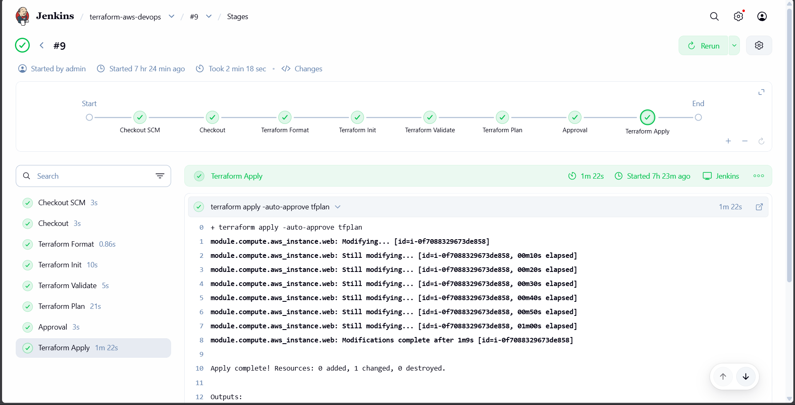
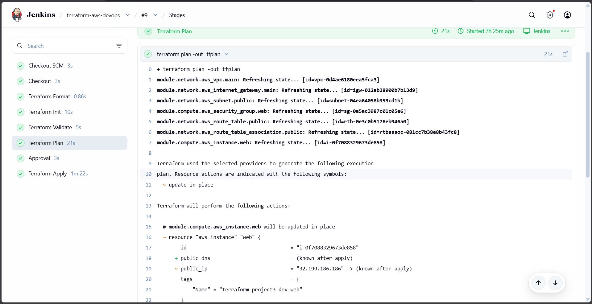
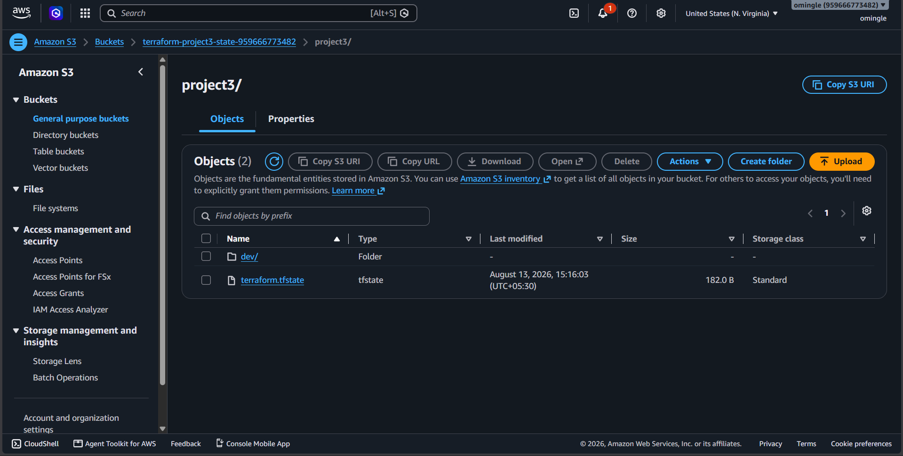

# Terraform AWS DevOps Infrastructure

A hands-on DevOps project demonstrating **Infrastructure as Code, AWS networking, Terraform modules, remote state management, and Jenkins CI/CD automation**.

The project provisions AWS infrastructure using Terraform and automates the Terraform workflow through Jenkins. The EC2 instance is automatically configured with Nginx using Terraform `user_data`.

---

## Architecture

```text
                         GitHub
                            |
                            v
                         Jenkins
                            |
              +-------------+-------------+
              | Terraform CI/CD Pipeline  |
              |                           |
              | fmt -> init -> validate   |
              |       -> plan             |
              |       -> approval         |
              |       -> apply             |
              +-------------+-------------+
                            |
                            v
                       AWS us-east-1
                            |
                           VPC
                       10.0.0.0/16
                            |
                     Public Subnet
                       10.0.1.0/24
                            |
              +-------------+-------------+
              |                           |
       Internet Gateway              Route Table
              |                           |
              +-------------+-------------+
                            |
                           EC2
                        t3.micro
                            |
                     Security Group
                       |          |
                    HTTP :80    SSH :22
                       |
                      Nginx
```

Terraform state is stored remotely:

```text
Terraform
    |
    v
S3 Backend
    |
    +-- project3/terraform.tfstate
```

---

## Project Objectives

- Learn Infrastructure as Code using Terraform
- Provision AWS infrastructure through code
- Create reusable Terraform modules
- Separate development and production configurations
- Store Terraform state remotely in Amazon S3
- Integrate Terraform with Jenkins
- Implement a CI/CD workflow for infrastructure
- Add manual approval before infrastructure changes are applied
- Automatically configure an EC2 instance using `user_data`
- Install and run Nginx automatically on the EC2 instance

---

## Technologies Used

| Technology | Purpose |
|---|---|
| Terraform | Infrastructure as Code |
| AWS | Cloud infrastructure |
| Amazon VPC | Virtual networking |
| Amazon EC2 | Compute |
| Amazon S3 | Terraform remote state |
| Jenkins | CI/CD automation |
| GitHub | Source code management |
| SSH | GitHub and EC2 authentication |
| Nginx | Web server |
| Linux | Server environment |

---

## AWS Infrastructure

The Terraform configuration creates:

- VPC
- Public Subnet
- Internet Gateway
- Public Route Table
- Route Table Association
- Security Group
- EC2 Instance
- Nginx configuration through EC2 `user_data`

### Development Network Configuration

```text
VPC CIDR:          10.0.0.0/16
Public Subnet:     10.0.1.0/24
Availability Zone: us-east-1c
AWS Region:        us-east-1
```

### EC2

```text
Instance Type: t3.micro
```

### Security Group

```text
TCP 80  -> HTTP
TCP 22  -> SSH
Outbound -> All traffic
```

---

## Terraform Module Structure

The infrastructure is divided into reusable modules.

### Network Module

Located in:

```text
modules/network/
```

Resources:

- VPC
- Public Subnet
- Internet Gateway
- Route Table
- Route Table Association

### Compute Module

Located in:

```text
modules/compute/
```

Resources:

- Security Group
- EC2 Instance

The compute module also uses EC2 `user_data` to automatically install Nginx.

---

## Project Structure

```text
terraform-aws-devops/
|
+-- Jenkinsfile
+-- main.tf
+-- variables.tf
+-- locals.tf
+-- outputs.tf
+-- terraform.tfvars
+-- .gitignore
+-- .terraform.lock.hcl
|
+-- modules/
|   |
|   +-- network/
|   |   +-- main.tf
|   |   +-- subnet.tf
|   |   +-- internet_gateway.tf
|   |   +-- route_table.tf
|   |   +-- route_table_association.tf
|   |   +-- variables.tf
|   |   +-- outputs.tf
|   |
|   +-- compute/
|       +-- main.tf
|       +-- variables.tf
|       +-- outputs.tf
|
+-- environments/
    |
    +-- dev/
    |   +-- main.tf
    |   +-- variables.tf
    |   +-- outputs.tf
    |   +-- terraform.tfvars
    |
    +-- prod/
        +-- main.tf
        +-- variables.tf
        +-- outputs.tf
        +-- terraform.tfvars
```

---

## Environment Configuration

The repository supports separate environments using the same reusable modules.

### Development

```text
Region:        us-east-1
Instance Type: t3.micro
VPC:           10.0.0.0/16
Subnet:        10.0.1.0/24
Environment:   dev
```

### Production

```text
Region:        us-east-1
Instance Type: t3.small
VPC:           10.1.0.0/16
Subnet:        10.1.1.0/24
Environment:   prod
```

The development environment was the environment provisioned and tested during this project.

---

## Terraform Remote State

Terraform uses an Amazon S3 backend.

```hcl
backend "s3" {
  bucket = "terraform-project3-state-959666773482"
  key    = "project3/terraform.tfstate"
  region = "us-east-1"
}
```

Remote state allows Terraform state to be stored outside the local working directory and accessed by the CI/CD environment.

Terraform state files are excluded from Git using:

```gitignore
.terraform/
*.tfstate
*.tfstate.*
```

---

## Jenkins CI/CD Pipeline

The Jenkins pipeline automates the Terraform workflow.

Pipeline stages:

```text
Checkout
   |
Terraform Format
   |
Terraform Init
   |
Terraform Validate
   |
Terraform Plan
   |
Manual Approval
   |
Terraform Apply
```

### 1. Checkout

Jenkins retrieves the Terraform repository from GitHub using SSH credentials.

### 2. Terraform Format

```bash
terraform fmt -check -recursive
```

Checks Terraform formatting.

### 3. Terraform Init

```bash
terraform init
```

Initializes Terraform, configures the S3 backend, and installs required providers.

### 4. Terraform Validate

```bash
terraform validate
```

Checks whether the Terraform configuration is valid.

### 5. Terraform Plan

```bash
terraform plan -out=tfplan
```

Generates a plan showing the infrastructure changes Terraform intends to make.

### 6. Manual Approval

Jenkins pauses and asks for approval before applying the infrastructure changes.

This provides a human review point before infrastructure changes are deployed.

### 7. Terraform Apply

```bash
terraform apply -auto-approve tfplan
```

Applies the approved Terraform plan.

---

## AWS Credentials in Jenkins

AWS credentials are stored in Jenkins Credentials rather than being hardcoded into the repository.

The pipeline uses Jenkins `withCredentials` to provide:

```text
AWS_ACCESS_KEY_ID
AWS_SECRET_ACCESS_KEY
```

to Terraform during the required stages.

This prevents AWS credentials from being committed to GitHub.

---

## EC2 Automatic Configuration

The EC2 instance uses Terraform `user_data`:

```bash
#!/bin/bash

dnf update -y
dnf install -y nginx
systemctl enable nginx
systemctl start nginx
```

This automatically:

1. Updates packages
2. Installs Nginx
3. Enables Nginx at boot
4. Starts Nginx

No manual application installation is required after the EC2 instance launches.

---

## Verification

The deployed EC2 instance was verified using SSH.

Example:

```bash
ssh -i ~/.ssh/aws_login.pem ec2-user@<PUBLIC-IP>
```

Nginx was verified with:

```bash
sudo ss -lntp | grep :80
```

and:

```bash
curl -I http://localhost
```

The server returned:

```text
HTTP/1.1 200 OK
```

External HTTP connectivity was also verified using:

```bash
curl http://<PUBLIC-IP>
```

The Nginx welcome page was successfully returned.

---

## Troubleshooting Performed

During development, several real-world issues were encountered and resolved.

### Jenkins GitHub SSH Host Verification

Jenkins initially failed because GitHub's SSH host key was not known.

Resolved by configuring GitHub's ED25519 host key in Jenkins' `known_hosts`.

### Jenkins AWS Authentication

Terraform initially failed because Jenkins did not have AWS credentials available.

Resolved by creating AWS credentials in Jenkins and injecting them using `withCredentials`.

### Terraform Module Variable Error

Terraform reported:

```text
The argument "environment" is required
```

The module input variable was correctly wired from the calling configuration.

### Terraform Resource Block Error

Terraform reported:

```text
Unsupported block type
```

The EC2 resource had accidentally been placed inside the Security Group resource. The resources were separated into independent Terraform resource blocks.

### EC2 SSH Authentication

SSH initially failed with:

```text
Permission denied (publickey)
```

The EC2 key pair was corrected by importing the public key corresponding to the local private key.

---

## Key DevOps Concepts Demonstrated

This project provided practical experience with:

- Infrastructure as Code
- Terraform
- Terraform state
- Remote S3 backend
- Terraform modules
- Environment separation
- AWS VPC networking
- Public subnets
- Internet Gateways
- Route tables
- Security Groups
- EC2
- SSH
- EC2 `user_data`
- Nginx
- GitHub
- Jenkins
- CI/CD
- Jenkins credentials
- Manual deployment approval
- Infrastructure troubleshooting
- Infrastructure lifecycle management

---

## Terraform Lifecycle

Typical workflow:

```bash
terraform init
terraform fmt
terraform validate
terraform plan
terraform apply
```

To remove infrastructure:

```bash
terraform destroy
```

---

## Future Improvements

Possible future enhancements include:

- Use IAM roles instead of long-lived AWS access keys
- Restrict SSH access to trusted IP addresses
- Add automated Terraform security scanning
- Add Terraform testing
- Add AWS monitoring and logging
- Add HTTPS using a domain and TLS certificate
- Add an Application Load Balancer
- Add autoscaling
- Add Docker/Kubernetes deployment
- Add Prometheus and Grafana monitoring

---
## Project Screenshots

### Jenkins Terraform CI/CD Pipeline

The Jenkins pipeline successfully executes Terraform formatting, initialization, validation, planning, manual approval, and application.



### Terraform Plan

Terraform detects infrastructure changes and generates an execution plan before deployment.



### Terraform Remote State in Amazon S3

Terraform state is stored remotely in an Amazon S3 backend.



## Author

**Om Suresh Ingle**

DevOps / Cloud Engineering Portfolio Project

GitHub: https://github.com/omsingle

LinkedIn: https://www.linkedin.com/in/om-ingle-00403b417/
